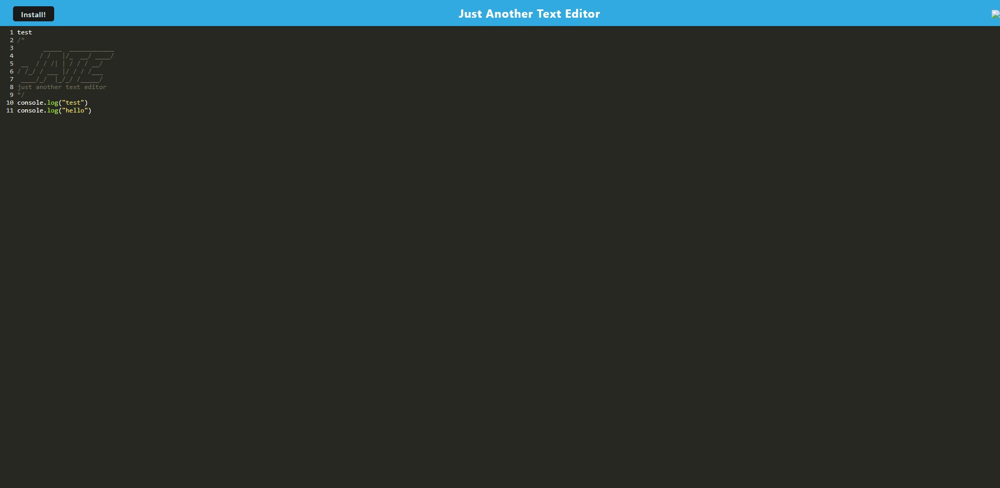

# Text-Editor-PWA


# Description

Text-Editor is an single-page application that allows users to store and get data to an IndexedDB database. The application will also function offline.

## User Story 

```md
AS A developer
I WANT to create notes or code snippets with or without an internet connection
SO THAT I can reliably retrieve them for later use
``` 

# Table of Contents
    
- [Installation](#installation)
    
- [Usage](#usage)
    
- [License](#license)
    
- [Contributing](#contributing)
    
- [Test](#test)
    
- [Questions](#questions)

# Installation 

This app requires dependencies to be installed:

- `git clone`
- `npm install` 

Then run the server in the command line: 

- `npm start`

 

# Usage

### Live URL: https://enigmatic-scrubland-90104.herokuapp.com/

# License 

This repository is licensed under MIT.

# Test

There are no test for this application.

# Questions 
  For any questions and comments please email me at: 
  damienjinks39@gmail.com.
  To view my other projects visit: 
  [Djinksy](https://github.com/Djinksy) on Github.